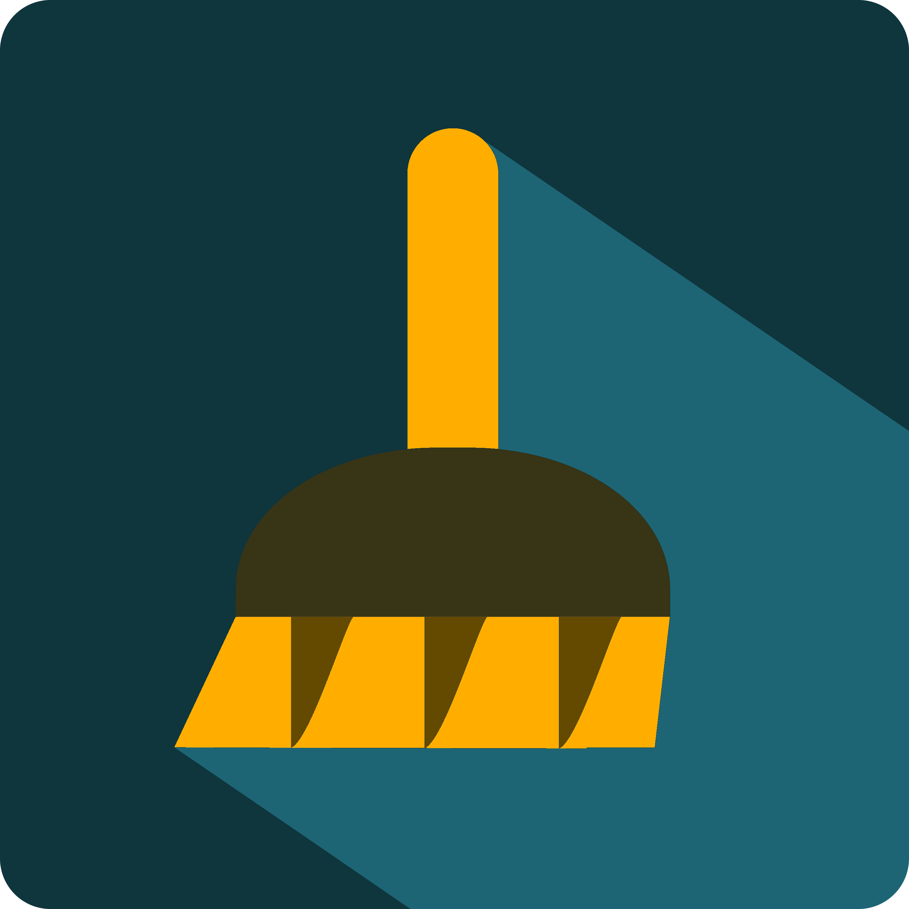
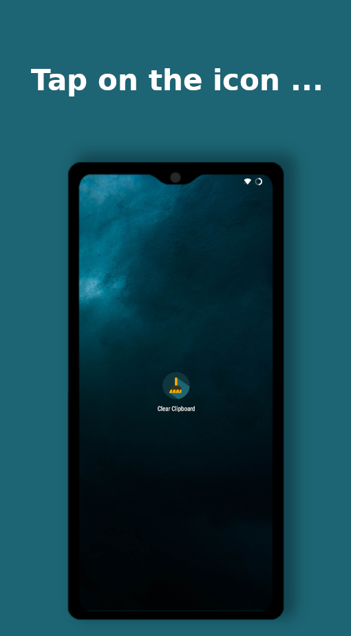
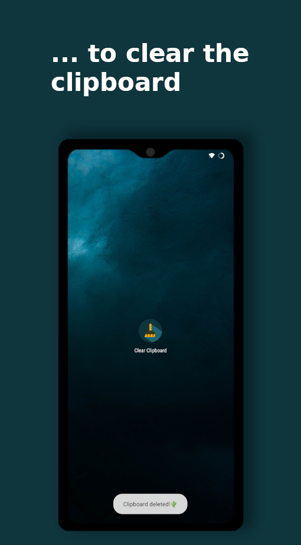

<h1 align="center">ClearClipboard</h1>

The app is a quick way to clear the content of the clipboard with just one tap on the icon.

**Note**: Only the current content of the clipboard is cleared, this app has no effect on other apps
which manage your clipboard. **This app does not work with Samsung or Google Pixel devices!**

## Motivation

During use, apps can read the clipboard content and use it for their purposes. This app allows
manual deletion of the clipboard to protect your own data.

## Screenshots

## Features

* Clears the clipboard with one tap

## Download

## Special

* no advertising
* no permissions needed

If you have any comments, please let me know.
